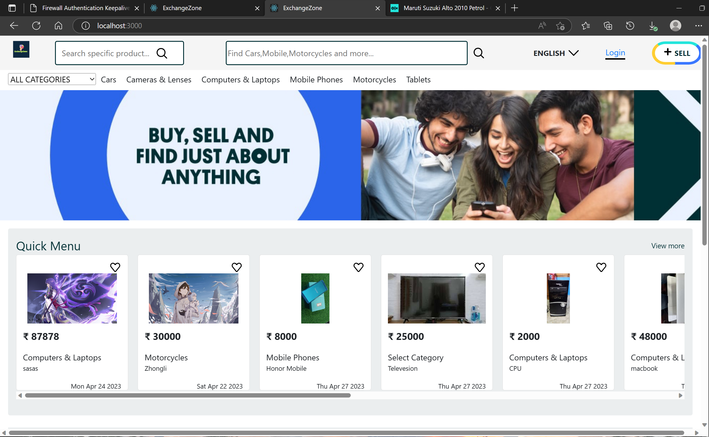

# ⚛️ ExchangeZone

Start your own website  in minutes with help of  React App. Exchage Zone is the potential classified advertisement website that categorizes objects in a user-friendly manner & displayed as an advertisement..,
Classifieds can be posted that involve selling, buying, exchanging and we adding a new feture that organizing to meet people nearby your location. 

- 👅 **Requirements of Project **
   - Intermediate React Developer
   - Basic Understanding of Firebase

- ExchageZone 

  

## 🦸 Tech Stack

**Client:** React, Context, CSS

**Server:** Firebase

  
## 🏄 Installation

  1. Clone/Download the repo.
  2. Run npm install.
  3. Config the BackEnd FireBase Change the values in src/firebase/config.js to suit your firebase console project api key values.
  4. Run npm start to spin the up the local dev server port 3000.(http://localhost:3000).
